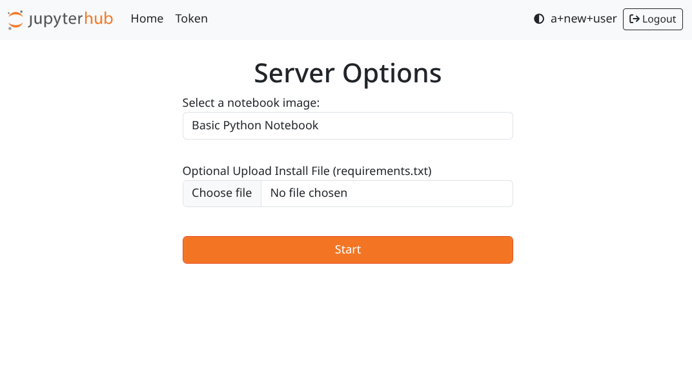

=================
jhub-SwarmSpawner
=================
.. image:: https://badge.fury.io/py/jhub-swarmspawner.svg
    :target: https://badge.fury.io/py/jhub-swarmspawner

**jhub-SwarmSpawner** enables `JupyterHub <https://github
.com/jupyterhub/jupyterhub>`_ to spawn jupyter notebooks across Docker Swarm cluster

More info about Docker Services `here <https://docs.docker.com/engine/reference/commandline/service_create/>`_.

Installation
============

.. code-block:: sh

   pip install jhub-swarmspawner

Installation from GitHub
========================

.. code-block:: sh

   git clone https://github.com/rasmunk/SwarmSpawner
   cd SwarmSpawner
   python setup.py install

Configuration
=============

You can find example JupyterHub configuration files in `examples <examples>`_.
To quickly get started the `jupyter_config_basic.py` can be used.

The Spawner
===========
Docker Engine in Swarm mode and the related services work in a different way compared to regular Docker containers.
Therefore the ``jhub.SwarmSpawner`` can be used to spawn user server's as a Docker Swarm Service in a precreated Docker Swarm Cluster.

To enable the ``jhub.SwarmSpawner`` it must be assigned to the ``c.JupyterHub.spawner_class`` option in the JupyterHub configuration file.
An example of this can be seen in `examples/jupyter_config_basic.py <examples/jupyter_config_basic.py>`_::

        c.JupyterHub.spawner_class = "jhub.SwarmSpawner"

Networks
========
It's important to put the JupyterHub service (also the proxy) and the services that are running jupyter notebook inside the same network, otherwise they can't reach each other.
In a Docker Swarm Cluster setting, this means that they are in the same `Overlay Network <https://docs.docker.com/engine/network/drivers/overlay/>`_.
The SwarmSpawner can be specified to use a specific network via the ``c.SwarmSPawner.networks`` configuration option::

        c.SwarmSpawner.networks = ["mynetwork"]


Specifying user service options
===============================
A Docker Swarm Service has a number of options that can be specified when it is launched.

Global Options
--------------
For a particular service configuration, the `TaskTemplate <https://docker-py.readthedocs.io/en/stable/api.html#docker.types.TaskTemplate>`_
is often the most relevant, and is therefore one of the structures that is used by the SwarmSpawner and exposes a number
of options for this::

        # Global service options
        c.SwarmSpawner.container_spec = {}
        
        c.SwarmSpawner.log_driver = {}

        c.SwarmSpawner.resource_spec = {}

        c.SwarmSpawner.placement = {}

        c.SwarmSpawner.networks = []

        c.SwarmSpawner.configs = []

Each of these can be specified in the JupyterHub configuration file and will apply globally to all spawned user services if defined.
The available options and formats for each of these can be found in the mentioned `TaskTemplate`_ reference.

In addition to these global options that are provided by the underlying ``docker-py`` module,
the SwarmSpawner implements a number of additional configuration options that can be seen below::

    # Docker images that are available to the user of the spawn.
    c.SwarmSpawner.images = []

    # The port on which the spawned service should listen.
    c.SwarmSpawner.service_port = 8888

    # Prefix for service names. The full service name for a particular user will be <prefix>-<hash(username)>-<server_name>.
    c.SwarmSpawner.service_prefix = "jupyter"

    # Name of the service running the JupyterHub
    c.SwarmSpawner.jupyterhub_service_name = "jupyterhub"

    # List of JupyterHub user attributes that are used to format Spawner State attributes.
    c.SwarmSpawner.user_format_attributes = []


Image Specific Options
----------------------

When the JupyterHub service is spawned, a properly authenticated user is able to select between the specified ``c.SwarmSpawner.images`` in the JupyterHub configuration.
For an image configuration in ``c.SwarmSpawner.images`` you are required to define the ``name`` and ``image`` key-value pairs.
An example of this can be seen below::

    c.SwarmSpawner.images = [
        {
            "name": "Python Notebook",
            "image": "ucphhpc/base-notebook:latest",
        }
    ]

Beyond the bare minimum it is also possible to apply each of the possible `TaskTemplate`_ options to a particular image configuration.
For instance, one can set the reqular `TaskTemplate`_ options for a particular image configuration::

    c.SwarmSpawner.images = [
        {
            "name": "Python Notebook",
            "image": "ucphhpc/base-notebook:latest",
            "container_spec": {},
            "log_driver": {},
            "resource_spec": {},
            "placement": {},
            "networks": [],
            "configs": []
        }
    ]


Furthermore, to customise how the launched Jupyter Notebook is started, the ``container_spec`` can be set.

Container_spec__
----------------
__ https://github.com/docker/docker-py/blob/master/docs/user_guides/swarm_services.md


The ``command`` and ``args`` definitions depends on the image that you are using.
I.e the command must be possible to execute in the selected image
The '/usr/local/bin/start-singleuser.sh' is provided by the jupyter
`base-notebook <https://github.com/jupyter/docker-stacks/tree/master/base-notebook>`_
The start-singleuser.sh ``args`` assumes that the launched image is extended from a version of this::

    c.SwarmSpawner.container_spec = {
                  # The command to run inside the service
                  'args' : ['/usr/local/bin/start-singleuser.sh']
          }


**Note:** in a container spec, ``args`` sets the equivalent of CMD in the Dockerfile, ``command`` sets the equivalent of ENTRYPOINT.
The notebook server command should not be the ENTRYPOINT, so generally use ``args``, not ``command``, to specify how to launch the notebook server.

See this `issue <https://github.com/cassinyio/SwarmSpawner/issues/6>`_  for more info.

Placement__
-----------
__ https://docs.docker.com/engine/swarm/services/#control-service-placement

The spawner supports Docker Swarm service placement configurations to be imposed on the
spawned services. This includes the option to specify
`constraints <https://docs.docker.com/engine/reference/commandline/service_create/#specify-service-constraints---constraint>`_
and `preferences <https://docs.docker
.com/engine/reference/commandline/service_create/#specify-service-placement-preferences
---placement-pref>`_
These can be imposed as a placement policy to all services being spawned. E.g.

.. code-block:: python

    c.SwarmSpawner.placement = {
        'constraints': ['node.hostname==worker1'],
        'preferences': ['spread=node.labels.datacenter']
    }

Dockerimages
------------

To define which images are available to the users, a list of `images` must be declared
The individual dictionaries also makes it possible to define whether the image should mount any volumes when it is spawned

.. code-block:: python

    # Available docker images the user can spawn
    c.SwarmSpawner.images = [
        {'image': 'jupyter/base-notebook:30f16d52126f',
         'name': 'Minimal python notebook'},
        {'image': 'jupyter/base-notebook:latest',
         'name': 'Image with automatic mount, supports Py2/3 and R,',
         'mounts': mounts}
    ]


It is also possible to specify individual placement policies for each image.
E.g.

.. code-block:: python

    # Available docker images the user can spawn
    c.SwarmSpawner.images = [
        {'image': 'jupyter/base-notebook:30f16d52126f',
         'name': 'Minimal python notebook',
         'placement': {'constraints': ['node.hostname==worker1']}},
    ]


To make the user able to select between multiple available images, the following must be
set.
If this is not the case, the user will simply spawn an instance of the default image. i.e. images[0]

.. code-block:: python

    # Before the user can select which image to spawn,
    # user_options has to be enabled
    c.SwarmSpawner.use_user_options = True

This enables an image select form in the users /hub/home url path when a notebook hasen't been spawned already.


Bind a Host dir
---------------
With ``'type':'bind'`` you mount a local directory of the host inside the container.

*Remember that source should exist in the node where you are creating the service.*

.. code-block:: python

        notebook_dir = os.environ.get('NOTEBOOK_DIR') or '/home/jovyan/work'
        c.SwarmSpawner.notebook_dir = notebook_dir

.. code-block:: python

        mounts = [{'type' : 'bind',
                'source' : 'MountPointOnTheHost',
                'target' : 'MountPointInsideTheContainer',}]


Volumes
-------
With ``'type':'volume'`` you mount a Docker Volume inside the container.
If the volume doesn't exist it will be created.

.. code-block:: python

        mounts = [{'type' : 'volume',
                'source' : 'NameOfTheVolume',
                'target' : 'MountPointInsideTheContainer',}]


Named path
----------
For both types, volume and bind, you can specify a ``{name}`` inside the source:

.. code-block:: python

        mounts = [{'type' : 'volume',
                'source' : 'jupyterhub-user-{name}',
                'target' : 'MountPointInsideTheContainer',}]


username will be the hashed version of the username.


Mount an anonymous volume
-------------------------
**This kind of volume will be removed with the service.**

.. code-block:: python

        mounts = [{'type' : 'volume',
                'source': '',
                'target' : 'MountPointInsideTheContainer',}]


SSHFS mount
----------------

It is also possible to mount a volume that is an sshfs mount to another host
supports either passing ``{id_rsa}`` or ``{password}`` that should be used to authenticate,
in addition the typical sshfs flags are supported, defaults to port 22

.. code-block:: python

        from jhub.mount import SSHFSMounter

        mounts = [SSHFSMounter({
                    'type': 'volume',
                    'driver_config': {
                        'name': 'ucphhpc/sshfs:latest',
                        'options' : {'sshcmd': '{sshcmd}', 'id_rsa': '{id_rsa}',
                                       'big_writes': '', 'allow_other': '',
                                       'reconnect': '', 'port': '2222', 'autoremove': 'True'},
                    }
                    'source': 'sshvolume-user-{name}',
                    'target': '/home/jovyan/work'})]


Automatic removal of Volumes
--------------------------------

To enact that a volume should be removed when the service is being terminated, there
are two options available, either use a ``anonymous`` volume as shown above, which will
remove the volume when the owning sevice is removed. Otherwise you can control whether volumes 
should be removed or not with the service with the ``autoremove``
label flag. e.g.

.. code-block:: python

        mounts = [{'type' : 'volume',
                'source' : 'jupyterhub-user-{name}',
                'target' : 'MountPointInsideTheContainer',
                'label': {'autoremove': 'True'}}]

Or

.. code-block:: python

        mounts = [{'type' : 'volume',
                'source' : 'jupyterhub-user-{name}',
                'target' : 'MountPointInsideTheContainer',
                'label': {'autoremove': 'False'}}]

With the default being 'False'.

Resource_spec
-------------

You can also specify some resource for each service

.. code-block:: python

        c.SwarmSpawner.resource_spec = {
                        'cpu_limit' : int(1 * 1e9), # (int) – CPU limit in units of 10^9 CPU shares.
                        'mem_limit' : int(512 * 1e6), # (int) – Memory limit in Bytes.
                        'cpu_reservation' : int(1 * 1e9), # (int) – CPU reservation in units of 10^9 CPU shares.
                        'mem_reservation' : int(512 * 1e6), # (int) – Memory reservation in Bytes
                        }

User form options
=================

By default, if the ``use_user_option`` is not enabled, the user wont be able to select between multiple available images, the user will simply spawn an instance of the default image. i.e. images[0].
Therefore, to allow the user to select between multiple available images, the following must be set in the JupyterHub configuration file.

.. code-block:: python

        # Allow user options in the spawn form
        c.SwarmSpawner.use_user_options = True

Allow user install files
------------------------

The ``c.SwarmSpawner.enable_user_upload_install_files`` option, can be toggled to allow the spawning users to upload files as part of the user selection form
when the ``c.SwarmSpawner.use_user_options`` is also enabled.

.. code-block:: python

        # Allow user options in the spawn form
        c.SwarmSpawner.use_user_options = True

        # Allow users to upload install files that can be used to prepare the requsted environment.
        c.SwarmSpawner.enable_user_upload_install_files = True

By default, the builtin ``c.SwarmSpawner.user_upload_form`` allows the user to upload a single file underneth the image selection form.



This form can be customised by overriding the ``c.SwarmSpawner.user_upload_form``. For instance if you wanted to allow multiple files to be uploaded
that can be enabled by adjusting the form ``c.SwarmSpawner.user_upload_form``.
In addition, the ``c.SwarmSpawner.allowed_user_upload_extensions`` option specifies which filetypes are allowed to be uploaded, which by default is ``.txt``` files.

Once a user Docker Swarm service is spawned, the uploaded install file(s) will be available in the ``c.SwarmSpawner.user_upload_destination_directory`` directory, which is set to ``/user-installs`` if left unchanged.
To subsequently automatically install the included uploaded install files, the `before-notebook.d <https://github.com/jupyter/docker-stacks/blob/52cc4677349c4a94e7481811d3953c2cc3e9e2fe/images/docker-stacks-foundation/start.sh#L255>`_ directory hook as provided by the Jupyter Notebook Image can be leveraged.

An example of this can be seen in `UCPHHPC Jupyter Service <https://github.com/ucphhpc/jupyter_service/tree/master>`_ with its `install_user_packages <https://github.com/ucphhpc/jupyter_service/blob/master/hub/before-notebook.d/9_install_user_packages.sh>`_ script.


Names of the Jupyter notebook service inside Docker engine in Swarm mode
--------------------------------------------------------------------------

When JupyterHub spawns a new Jupyter notebook server the name of the service will be ``{service_prefix}-{service_owner}-{service_suffix}``
By default the service_prefix is set to ``jupyter``, but it can be changed with the following option::

        c.SwarmSpawner.service_prefix = "some-other-prefix"


``service_owner`` is the hexdigest() of the hashed ``user.name``.

In case of named servers (more than one server for user) ``service_suffix`` is the name of the server, otherwise is always ``1``.

Downloading images
-------------------
Docker Engine in Swarm mode downloads images automatically from the repository.
Either the image is available on the remote repository or locally, if not you will get an error.

Because before starting the service you have to complete the download of the image is better to have a longer timeout (default is 30 secs)::

        c.SwarmSpawner.start_timeout = 60 * 5


You can use all the docker images inside the `Jupyter docker-stacks`_.

.. _Jupyter docker-stacks: https://github.com/jupyter/docker-stacks


Credit
======
`DockerSpawner <https://github.com/jupyterhub/dockerspawner>`_
`CassinyioSpawner <https://github.com/cassinyio/SwarmSpawner>`_


License
=======
All code is licensed under the terms of the revised BSD license.
